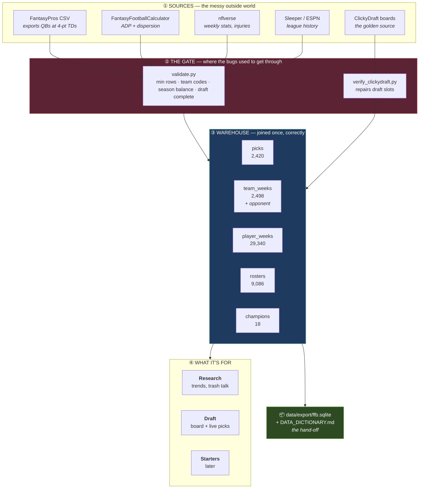

# What this repo is, in one picture

Data comes in from five outside sources, gets cleaned and joined **once**, and
three different things read from that clean layer.



## The four pieces

**① Sources** — five outside feeds, each with its own quirks, all documented in
`docs/DATA.md`.

**② The gate** — `src/draft/validate.py` refuses bad data at the moment it would
be written. Every check exists because that exact bug already happened here: a
paywalled 10-of-852 API slice, a team-code mismatch that deleted two teams' bye
weeks, a schema difference that deleted four seasons of injury data.
`scripts/verify_clickydraft.py` is separate because it does something unusual —
it repairs the archive against photographs of the original draft boards.

**③ The warehouse** — five tables, one grain each, joins already resolved. The
one that matters most is `team_weeks`, because it carries **who you actually
played**, reconstructed by score-matching since the platforms never recorded
opponent names.

**④ Three uses** — research, draft, starters. Plus `data/export/`: one SQLite
file anyone can open, with a dictionary stating every caveat.

## What "clean" means here

Not that the data is perfect — that the imperfections are **known and written
down**. The dictionary tells a new reader that opponents are reconstructed, that
18 win-flags contradict their own scores, that bench players were never
exported, and that the platforms name the wrong champion in at least three
seasons. That honesty is what makes it hand-off-able.

Rebuild the whole thing:

```bash
python -m scripts.fetch_data          # sources -> data/draft/
python -m scripts.build_warehouse     # -> data/warehouse/
python -m scripts.export_datasheet    # -> data/export/
python -m pytest tests/ -q            # 201 invariants
```
